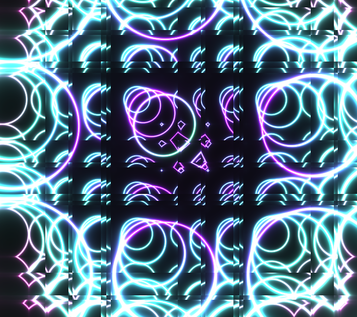
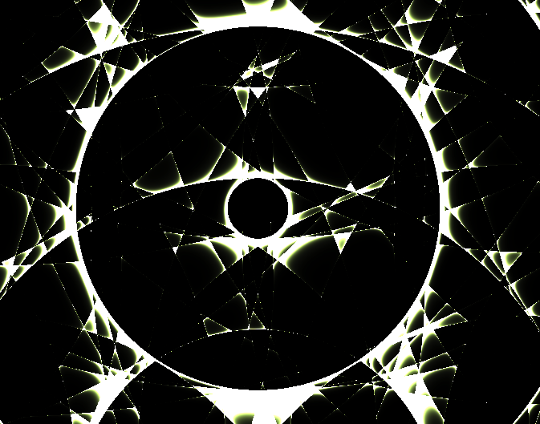
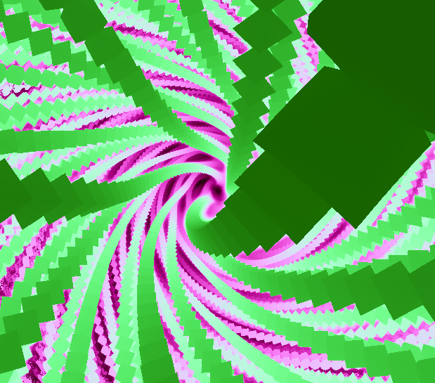
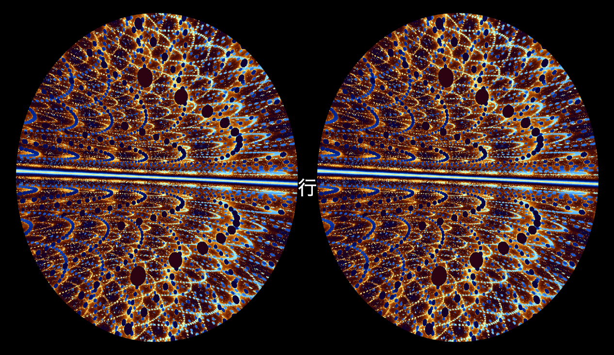

# Shcon
A project exploring GLSL shader programming and a consideration on its implementation in user intefaces and experiences.

<a href="https://shcon-902b612ebe5d.herokuapp.com/random">Live</a>
 

&nbsp;
## Prerequisites
Node.js (v18.16.0 >=) installed on local machine.

&nbsp;
## Installation & Setup
1. Clone the repository.
2. Navigate to cloned directory and run `npm i`
3. In a terminal window, run `npm run dev`
4. Open browser window to localhost:9800

&nbsp;
## Featues
Animation start and stop controlled by user input.
- 'J' to start (and speed up)
- 'P' to stop (and slow down)

Application endpoints that serve pages with various functionality
&nbsp;
<a href="https://shcon-902b612ebe5d.herokuapp.com/random">Random</a>
- `/random` displays a randomly chosen shader animation from the shaders folder 

&nbsp;
<a href="https://shcon-902b612ebe5d.herokuapp.com/mouse">Mouse</a>
- `/mouse` for mouse click interactivity

&nbsp;
<a href="https://shcon-902b612ebe5d.herokuapp.com/Dos">Dos</a>
- `/dos` renders animations in two separate canvases

&nbsp;
## ShaderSetup Documentation
This project includes a custom class, ShaderSetup, designed to simplify the setup, creation, and management of WebGL shader programs renderd on an HTML canvas.
It handles shader compilation, buffer initialization, and rendering on an HTML canvas.

### Constructor
Creates an instance of the ShaderSetup class.

Parameters:
* gl (WebGLRenderingContext) – The WebGL rendering context.
* canvas (HTMLCanvasElement) – The canvas element used for rendering.

Returns:
* A new ShaderSetup instance.

&nbsp;
### Methods

### loadShader(type, source)
Compiles a WebGL shader of the specified type.

Parameters:
* type (number) – The shader type (e.g., gl.VERTEX_SHADER or gl.FRAGMENT_SHADER).
* source (string) – The GLSL source code for the shader.

Returns: 
* WebGLShader | null – The compiled shader, or null if compilation fails.

Throws:
* Error – If the shader fails to compile

&nbsp;
### initProgram(vsSource, fsSource)
Initializes and links a shader program using the provided vertex and fragment shader sources.

Parameters:
* vsSource (string) – The GLSL source code for the vertex shader.
* fsSource (string) – The GLSL source code for the fragment shader.

Returns:
* void

Throws:
* Error – If linking fails.

&nbsp;
### initBuffers()
Creates and initializes WebGL buffers for rendering.

Returns:
* void

### initLocations()
Configures shader attribute and uniform locations.

Returns:
* void

&nbsp;
### setup(vs, fs)
Sets up the shader program, initializes buffers and locations, clears the canvas, and starts rendering.

Parameters:
* vs (string) – The GLSL source code for the vertex shader.
* fs (string) – The GLSL source code for the fragment shader.

Returns:
* void

&nbsp;
### reset(vs, fs)
Resets the shader program and reinitializes buffers and locations before rendering.

Parameters:
* vs (string) – The GLSL source code for the vertex shader.
* fs (string) – The GLSL source code for the fragment shader.

Returns:
* void

&nbsp;
### clear()
Clears the WebGL canvas.

Returns:
* void

&nbsp;
### pause()
Pauses rendering by canceling the animation frame request.

Returns:
* void

&nbsp;
### render()
Handles rendering and recursivley updates the shader's time uniform on each frame.

Returns:
* void

&nbsp;&nbsp;
### Contributing
Want to contribute? Please fork the repo and submit a pull request!

